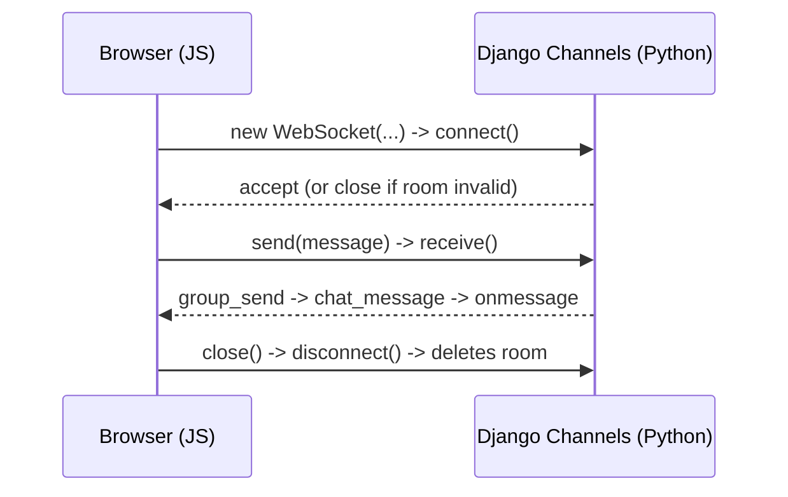

# How the chat (WebSocket) flow works

Quick notes for future me — Django Channels needs a little JS in the browser
because Python can't run client-side. The JS vocabulary needed here is tiny:
`new WebSocket`, `.onmessage`, `.onclose`, `.send()`, `.close()`. Nothing else.



## JS side (`chat.html`)

- `new WebSocket("ws://.../ws/chat/<room_code>/")` — opens a persistent
  connection to the consumer. Like `requests.get()` but it stays open.
- `chatSocket.onmessage = function(e) {...}` — runs automatically whenever
  the server pushes data down the socket. Read `e.data` (JSON) and render it.
- `chatSocket.send(JSON.stringify({...}))` — sends data up to the server,
  the equivalent of a POST body.
- `chatSocket.close()` — closes the socket; this is what triggers Python's
  `disconnect()` on the server.

## Python side

- `consumers.py` replaces `views.py` for websockets. One class with
  lifecycle methods instead of one function per request:
  - `connect()` — runs once when the browser opens the socket; validates the
    room then calls `accept()`.
  - `receive()` — runs every time the browser calls `.send()`.
  - `disconnect()` — runs when the socket closes (tab closed, `.close()`
    called, network drop). Deletes the `ChatRoom` row for that room code.
  - `chat_message()` — a custom handler invoked when any consumer in the
    group calls `group_send` with `'type': 'chat_message'`. Channels routes
    by matching the `type` string to a method name of the same name.
- `routing.py` is a URL router for websocket paths, same mental model as
  `urls.py` but for `ws/...` paths instead of HTTP paths.
- A "group" (`self.channel_layer.group_add`) is just a named broadcast list.
  Every consumer that joins `chat_{room_id}` receives messages sent to that
  group via `group_send`.

## Room lifecycle

- Room created in `views.create_room` when a user creates a room.
- Room deleted automatically in `ChatConsumer.disconnect()` when either
  side's socket closes (tab close, network drop, or clicking "Leave Room").
- The "Leave Room" button in `chat.html` just calls `chatSocket.close()`,
  which triggers the same `disconnect()` cleanup path.

## React frontend and Django backend

The React frontend lives in `frontend/web` and connects to Django through the
Vite development proxy. Run the two servers from separate terminals:

```bash
cd backend
uv run manage.py runserver 127.0.0.1:8000
```

```bash
cd frontend/web
npm run dev
```

Open `http://localhost:5173/`. Vite forwards `/create_room`, `/join_room`,
and `/ws` to Django at `127.0.0.1:8000`. Using the IPv4 address avoids Linux
`localhost` resolving to `::1` while Django listens on IPv4.

The React room flow uses these backend contracts:

- `GET /create_room/?format=json` creates a room and returns its 8-character
  `room_code` with the `root` role.
- `GET /join_room/<room_code>/?format=json` validates an active room and
  returns the `user` role.
- `ws://<frontend-host>/ws/chat/<room_code>/?role=root` is the controller
  connection. The receiver uses `role=user` and can only receive signals.
- The backend accepts `next` and `back` signals from the root connection and
  broadcasts them to the room group.

The frontend uses `controller` and `receiver` labels in the UI, mapping them
to Django's `root` and `user` websocket roles respectively. Do not run
`npm run dev` from `frontend`; the `package.json` is inside `frontend/web`.
